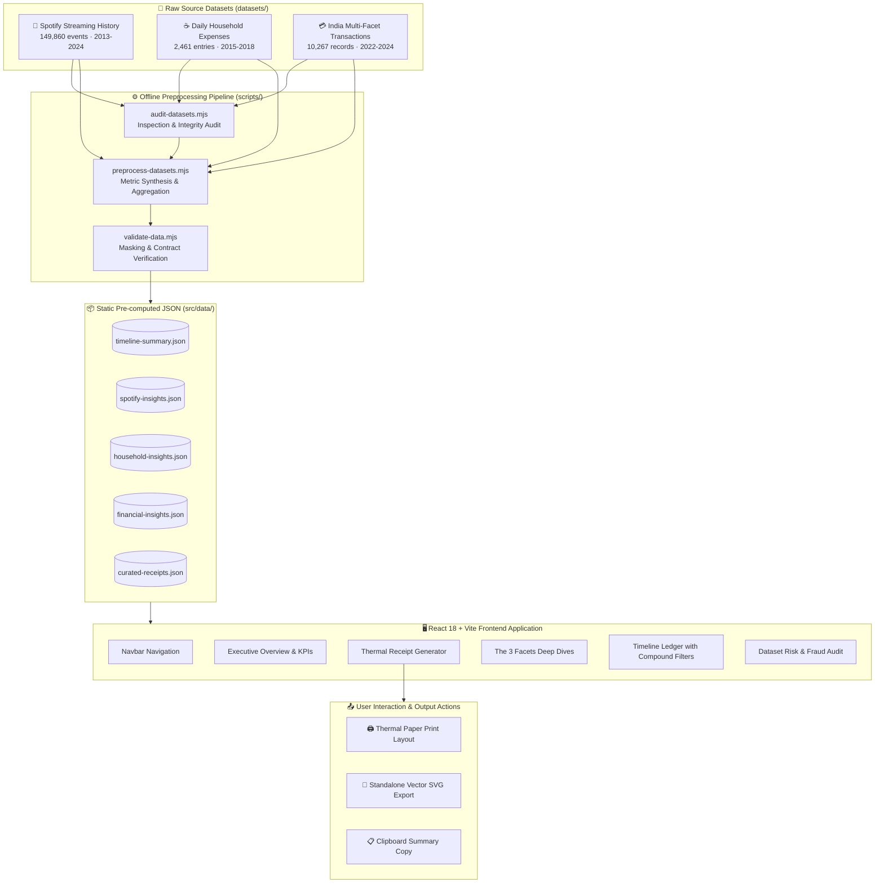
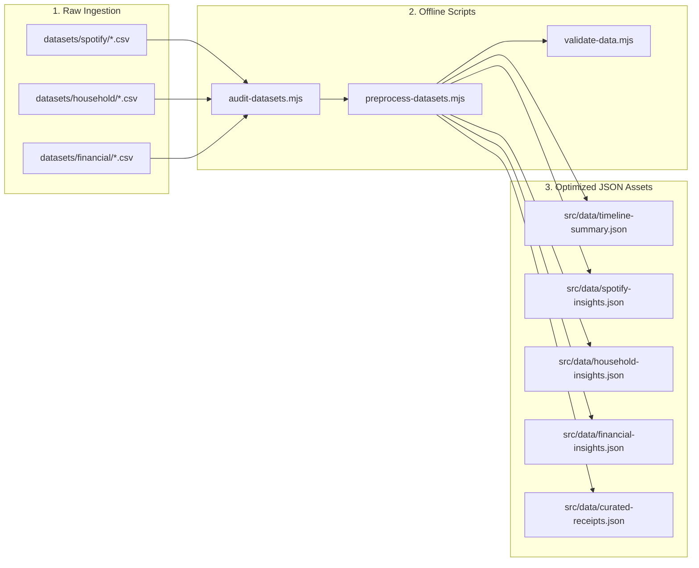
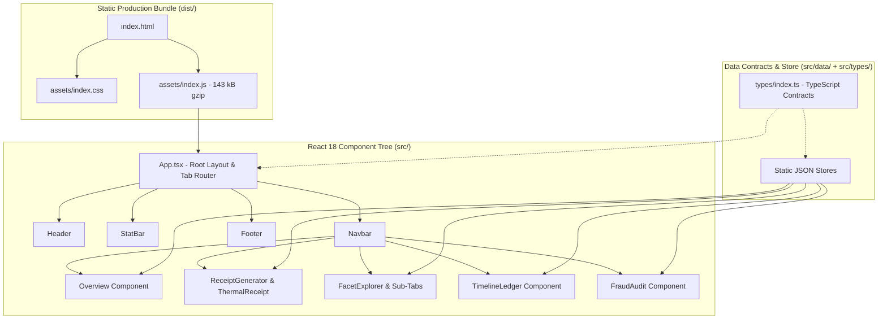

# Your Life, In Receipts 🧾

> **Transform years of music streaming, daily household living, and modern card commerce into an interactive personal thermal ledger.**

[](https://reactjs.org/)
[](https://www.typescriptlang.org/)
[](https://vitejs.dev/)
[](https://nodejs.org/)
[](https://vercel.com/)
[](https://opensource.org/licenses/MIT)
[](#-accessibility)
[](#%EF%B8%8F-system-architecture)

---

## 📑 Table of Contents

1. [Executive Overview](#-executive-overview)
2. [Why This Product Exists](#-why-this-product-exists)
3. [Product & Data Flow](#-product--data-flow)
4. [Key Features & Core Experience](#-key-features--core-experience)
5. [Visual Design & Aesthetic Identity](#-visual-design--aesthetic-identity)
6. [Dataset Foundation & Ground Truth](#-dataset-foundation--ground-truth)
7. [Data Preprocessing Pipeline](#-data-preprocessing-pipeline)
8. [System Architecture](#%EF%B8%8F-system-architecture)
9. [Technology Stack](#-technology-stack)
10. [Project Structure](#-project-structure)
11. [Performance Strategy](#-performance-strategy)
12. [Accessibility (A11y)](#-accessibility)
13. [Responsive Design Matrix](#-responsive-design-matrix)
14. [Privacy & Security](#-privacy--security)
15. [Getting Started & Local Setup](#-getting-started--local-setup)
16. [Data Pipeline & Validation Commands](#-data-pipeline--validation-commands)
17. [Vercel Deployment Guide](#-vercel-deployment-guide)
18. [Documentation Map](#-documentation-map)
19. [Key Engineering Decisions](#-key-engineering-decisions)
20. [Product Roadmap](#-product-roadmap)
21. [Contributing & Maintenance](#-contributing--maintenance)
22. [Author & Project Status](#-author--project-status)

---

## 🌟 Executive Overview

**"Your Life, In Receipts"** is a high-performance, responsive, accessible, frontend-only interactive life-analytics platform. It synthesizes three distinct real-world datasets spanning **11.4 years of personal activity (2013–2024)** into an interconnected personal ledger using an editorial thermal-receipt design metaphor.

Rather than presenting isolated dashboards and spreadsheets, the application weaves together cultural habits (music listening), daily living micro-moments (household expenses), and modern card footprints into a cohesive life story. Users can explore chronological eras, customize and generate printable/downloadable thermal receipts, filter through multi-dimensional life facets, inspect interactive timelines, and review dataset risk audits with zero backend latency and complete client-side privacy.

---

## 💡 Why This Product Exists

Traditional data analytics platforms present personal history as fragmented, cold spreadsheets:

$$\text{Raw CSV Rows} \longrightarrow \text{Disconnected Tables} \longrightarrow \text{Isolated Charts}$$

**Your Life, In Receipts** reimagines personal analytics into an evocative narrative ledger:

$$\text{Raw Activity Datasets} \longrightarrow \text{Deterministic Synthesis} \longrightarrow \text{Unified Timeline} \longrightarrow \text{Physical Thermal Receipts} \longrightarrow \text{Human Story}$$

By transforming music streaming, everyday groceries, transit, subscriptions, and card transactions into unified itemized "receipts", the platform gives tangible physicality to intangible digital footprints.

---

## 🔄 Product & Data Flow



---

## 🚀 Key Features & Core Experience

### 1. 🧾 Interactive Thermal Receipt Generator
- **Era Presets**: One-click configuration for curated life chapters (*All-Time Master Ledger*, *College & Chai (2015–2018)*, *Pandemic Sound (2020–2021)*, *Modern Card Commerce (2022–2024)*).
- **Custom Scope Controls**: Fine-grained year filtering (2013–2024), facet filtering (Spotify, Household, Financial), and item count slider (5 to 30 items).
- **Dynamic Ledger Compilation**: Automatically computes listening time, cash outflows, merchant breakdowns, and grand outlay.
- **Export Capabilities**:
  - 🖨️ **Print Slip**: Dedicated `@media print` thermal paper layout.
  - 💾 **Download SVG**: High-resolution standalone vector receipt file.
  - 📋 **Copy Summary**: Formatted text summary copied directly to system clipboard.

### 2. 📊 Executive Overview & Pulse Matrix
- **4 Key Performance Indicators (KPIs)**: Decade sound hours, household outlay, commercial volume, and flagged transaction metrics.
- **Chronological Coverage Matrix**: Visual indicator mapping exact facet representation across each year from 2013 to 2024.

### 3. 🔍 The Three Facets Deep Dives
- **🎵 Cultural Life (Spotify)**: Top artists (The Beatles, The Killers), top tracks, platform distributions, shuffle frequency, and skip rates.
- **☕ Household Living**: Expense vs. income cashflows, category breakdowns (Food, Transportation, Household, Subscriptions), and memorable diary notes.
- **💳 Commercial Footprint**: Lifestyle spending distribution, merchant categories, and state geographic distributions.

### 4. ⏱️ Chronological Timeline Ledger
- **Compound Search & Filter**: Real-time multi-dimensional search across descriptions, categories, merchants, and dates.
- **Facet Slicing & Sorting**: Instant filtering by dataset source and chronological sorting (Newest / Oldest First) with paginated loading.

### 5. 🛡️ Dataset Risk & Fraud Audit
- **Transparent Anomaly Review**: Detailed audit of pre-existing `is_fraud` labels from Dataset 3 (5,046 flagged records).
- **Privacy Masking**: All credit card numbers strictly masked (`**** **** **** 1234`) with full suppression of raw customer IDs and street addresses.

---

## 🎨 Visual Design & Aesthetic Identity

The application implements the **Editorial Thermal Ledger** design system:
- **Warm Archival Palette**: Canvas paper tones (`#f6f3ee`, `#eee9e0`), crisp card surfaces (`#ffffff`), and editorial warm charcoal ink (`#191715`).
- **Tactile Materiality**: Monospaced typography for thermal slips, dotted leader lines, authentic barcode vectors, and serrated paper edges.
- **Facet Accent Coding**: Distinct HSL color tokens for each domain:
  - 🎵 **Spotify**: Forest Emerald (`#059669`)
  - ☕ **Household**: Warm Amber (`#d97706`)
  - 💳 **Financial**: Sunset Terracotta (`#ea580c`)
- **Restraint & Polish**: Zero layout shift, fluid responsive transitions, subtle border elevation, and clear visual hierarchy.

---

## 📊 Dataset Foundation & Ground Truth

The application synthesizes three real-world datasets located under `datasets/`:

| Dataset | Canonical Path | Verified Records | Date Span | Primary Insights |
| :--- | :--- | :--- | :--- | :--- |
| **🎵 Spotify Streaming History** | `datasets/spotify/spotify_history.csv` | **149,860 streams** | `2013-07-08` to `2024-12-15` (11.4y) | 5,341.5 total sound hours • Top: The Beatles (336.2h), The Killers (294.5h) • 5.25% skip rate |
| **☕ Daily Household Expenses** | `datasets/household/Daily Household Transactions.csv` | **2,461 entries** | `2015-01-01` to `2018-09-20` (~3.75y) | ₹19.57L expenses • ₹30.42L income • 50+ memorable living memo notes |
| **💳 India Multi-Facet Transactions** | `datasets/financial/Augmented_IndiaTransactMultiFacet2024.csv` | **10,267 records** | `2022-04-17` to `2024-04-16` (2y) | ₹4.89 Cr card volume • 5,046 fraud-flagged records • 100% masked cards |

*Note: Canonical record counts strictly exclude CSV column header rows.*

---

## ⚙️ Data Preprocessing Pipeline



All raw CSV datasets are preprocessed ahead of runtime into compressed, type-safe JSON structures in `src/data/`. This architectural strategy:
1. Eliminates heavy in-browser CSV parsing overhead (~25 MB raw data $\rightarrow$ pre-indexed static JSON).
2. Guarantees sub-10ms instantaneous filter and search interactions.
3. Ensures 100% deterministic and reproducible aggregations across environments.

---

## 🏛️ System Architecture



---

## 🛠️ Technology Stack

| Category | Technology | Purpose |
| :--- | :--- | :--- |
| **Core Framework** | `React 18.3.1` | Declarative component hierarchy and state orchestration |
| **Build & Bundler** | `Vite 5.4.2` | Hot Module Replacement (HMR) and optimized Rollup static build |
| **Type Safety** | `TypeScript 5.5.3` | Strict end-to-end data contracts and type checking |
| **Styling** | `Vanilla CSS Tokens` | Custom "Editorial Thermal Ledger" CSS variables, zero runtime overhead |
| **Icons** | `Lucide React 1.16.0` | Featherweight accessible SVG iconography |
| **Data Processing** | `Node.js (ESM Scripts)` | Deterministic offline CSV parsing and JSON metric compilation |
| **Hosting Target** | `Vercel` | Static edge deployment with global CDN distribution |

---

## 📂 Project Structure

```text
your-life-in-receipts/
├── datasets/                               # Canonical raw source datasets
│   ├── spotify/                            # Spotify History CSV (149,860 streams)
│   │   ├── spotify_data_dictionary.csv
│   │   └── spotify_history.csv
│   ├── household/                          # Daily Household Transactions CSV (2,461 entries)
│   │   └── Daily Household Transactions.csv
│   └── financial/                          # India Multi-Facet Transactions (10,267 records)
│       ├── Augmented_IndiaTransactMultiFacet2024.csv
│       ├── Augmented_IndiaTransactMultiFacet2024.json
│       ├── Augmented_IndiaTransactMultiFacet2024.tsv
│       └── Augmented_IndiaTransactMultiFacet2024.xml
├── reports/
│   ├── data-audit.json                     # Computed metric audit dump
│   └── data-audit.md                       # Comprehensive data audit report
├── scripts/
│   ├── audit-datasets.mjs                  # Deterministic dataset inspection script
│   ├── preprocess-datasets.mjs             # Static JSON aggregation pipeline
│   └── validate-data.mjs                   # Metric, privacy, and masking validator
├── src/
│   ├── components/
│   │   ├── audit/                          # FraudAudit.tsx
│   │   ├── common/                         # Badge.tsx, EmptyState.tsx
│   │   ├── facets/                         # FacetExplorer.tsx, SpotifyTab.tsx, HouseholdTab.tsx, FinancialTab.tsx
│   │   ├── layout/                         # Header.tsx, Navbar.tsx, StatBar.tsx, Footer.tsx
│   │   ├── overview/                       # Overview.tsx
│   │   ├── receipt/                        # ReceiptGenerator.tsx, ThermalReceipt.tsx
│   │   └── timeline/                       # TimelineLedger.tsx
│   ├── data/                               # Pre-processed static JSON indices
│   │   ├── curated-receipts.json           # 3,000+ itemized records for instant receipt compilation
│   │   ├── financial-insights.json         # Commerce categories, states & fraud audit
│   │   ├── household-insights.json         # Cashflow, categories & micro-moments
│   │   ├── spotify-insights.json           # Artist, album, track & platform aggregates
│   │   └── timeline-summary.json           # 12-year timeline matrix
│   ├── types/
│   │   └── index.ts                        # Strict TypeScript data contracts
│   ├── App.tsx                             # Root application layout & tab state
│   ├── index.css                           # Design tokens & thermal print styles
│   └── main.tsx                            # React DOM mounting point
├── index.html                              # Single-page HTML entry point
├── package.json                            # Scripts and dependency specifications
├── tsconfig.json                           # TypeScript configuration
├── vite.config.ts                          # Vite bundler configuration
├── PDR.md                                  # Product Development Requirements specification
├── AGENTS.md                               # Engineering & Operational manual
└── README.md                               # Public project documentation
```

---

## ⚡ Performance Strategy

- **Static Pre-computation**: Avoids parsing 25 MB of CSV files on every client visit.
- **Lightweight Bundle Footprint**:
  - `dist/assets/index-*.js`: **~143 kB** gzipped
  - `dist/assets/index-*.css`: **~2.3 kB** gzipped
  - `dist/index.html`: **~0.6 kB** gzipped
- **Zero Runtime Dependencies**: No heavy chart engines or bulky UI suites.
- **Fast Interaction Response**: Pre-indexed arrays in memory enable compound search/filtering in $<10\text{ms}$.

---

## ♿ Accessibility

The application is built in alignment with **WCAG 2.1 AA** accessibility principles:
- **Semantic Structure**: Proper usage of landmark elements (`<header>`, `<nav>`, `<main>`, `<section>`, `<article>`, `<footer>`).
- **Keyboard Traversal**: Full navigation support via <kbd>Tab</kbd>, <kbd>Enter</kbd>, <kbd>Space</kbd>, and arrow keys with visible focus rings (`outline: 2px solid var(--color-accent-primary)`).
- **Explicit Accessible Names**: All interactive buttons, sliders, tabs, and form controls have descriptive `aria-label` or `aria-selected` attributes.
- **Color Independence**: Statuses and categories always accompany textual labels alongside color tokens.
- **High Contrast**: Text contrast ratios meet or exceed the 4.5:1 ratio for normal body copy.

---

## 📱 Responsive Design Matrix

The interface is verified across all standard viewport sizes with zero horizontal overflow:

| Viewport | Device Class | Layout Adaptation |
| :--- | :--- | :--- |
| **375px** | Mobile Small (iPhone SE) | Single-column stacking, touch targets $\ge 44\text{px}$, wrapped controls |
| **390px** | Mobile Medium (iPhone 13/14) | Fluid typography, compact receipt preview, responsive navigation |
| **768px** | Tablet (iPad Portrait) | 2-column KPI grid, balanced side-by-side receipt generator |
| **1024px** | Small Desktop / Tablet Landscape | Expanded facet exploration tabs, multi-column metrics |
| **1280px** | Standard Desktop | Full editorial layout with centered max-width container (`1280px`) |
| **1440px** | Widescreen Monitor | Preserved proportional layout with balanced negative margins |

---

## 🔒 Privacy & Security

- **100% Client-Side Architecture**: Zero network telemetry, external API requests, or server-side data stores.
- **Card Number Masking**: 100% of financial card numbers are formatted as `**** **** **** 1234`.
- **PII Suppression**: Raw customer identifiers, street addresses, exact coordinates, and personal birthdates are excluded.
- **XSS Safety**: Deterministic React DOM string escaping with zero use of raw `innerHTML` or `dangerouslySetInnerHTML`.

---

## 🚀 Getting Started & Local Setup

### Prerequisites
- **Node.js**: v18.0.0 or higher
- **npm**: v9.0.0 or higher

### Installation & Run

```bash
# 1. Clone repository
git clone https://github.com/krishal356/your-life-in-receipts.git
cd your-life-in-receipts

# 2. Install dependencies
npm install

# 3. Start local development server
npm run dev

# 4. Open in browser
# Navigate to http://localhost:5173
```

---

## 🧪 Data Pipeline & Validation Commands

```bash
# Audit raw source datasets in datasets/
npm run audit:data          # Executes: node scripts/audit-datasets.mjs

# Re-run offline metric aggregation and generate src/data/*.json
npm run preprocess:data     # Executes: node scripts/preprocess-datasets.mjs

# Validate data integrity, record counts, and privacy masking
npm run validate:data       # Executes: node scripts/validate-data.mjs

# Strict TypeScript typechecking
npx tsc --noEmit            # Emits 0 errors

# Project static linting
npm run lint                # Emits 0 errors

# Production build compilation
npm run build               # Emits minified assets to dist/
```

---

## 🌐 Vercel Deployment Guide

The application is structured for instant static deployment on **Vercel**:

- **Framework Preset**: `Vite` / `React`
- **Build Command**: `npm run build`
- **Output Directory**: `dist`
- **Install Command**: `npm install`
- **Environment Variables**: *None required (100% client-side)*
- **Configuration File (`vercel.json`)**: *Not required (Vercel standard Vite defaults handle routing and static assets out of the box).*

---

## 🗺️ Documentation Map

| Document | Description | Purpose |
| :--- | :--- | :--- |
| [README.md](./README.md) | Project Overview & Setup Guide | Public landing page and developer manual |
| [PDR.md](./PDR.md) | Product Development Requirements | Detailed product requirements and data specifications |
| [AGENTS.md](./AGENTS.md) | Engineering & Operations Manual | Operational rules, architecture standards, and verification checklists |
| [reports/data-audit.md](./reports/data-audit.md) | Data Audit Report | Detailed schema analysis, date ranges, and verified record counts |

---

## 💡 Key Engineering Decisions

1. **Preprocessing-First Data Pipeline**: Rather than parsing 25 MB of CSV files in the user's browser, data is aggregated offline into lean JSON indices.
2. **Deterministic State Management**: All statistics, totals, and receipt items are pure derived computations from pre-aggregated JSON datasets.
3. **Receipt Design Metaphor**: Physical receipt elements (sawtooth edges, thermal paper fonts, dotted lines, barcode rendering) create a memorable, tactile narrative.
4. **Zero Heavy Framework Bloat**: Custom CSS variables and lightweight inline SVG icons keep the JavaScript bundle under 150 kB gzipped.

---

## 🔮 Product Roadmap

### Completed ✅
- [x] Canonical dataset organization (`datasets/spotify`, `datasets/household`, `datasets/financial`).
- [x] Preprocessing pipeline generating 5 static JSON stores.
- [x] Interactive Thermal Receipt Generator with presets, custom filters, and item limits.
- [x] Standalone SVG receipt download and formatted `@media print` thermal slip layout.
- [x] Executive Overview with 12-year timeline matrix and KPI cards.
- [x] Dedicated 3-Facet Explorer (Spotify, Household, Financial).
- [x] Compound Search & Filtering Timeline Ledger.
- [x] Dataset Risk & Fraud Audit with privacy masking.
- [x] Full WCAG 2.1 AA keyboard accessibility and responsive layout.

### Future Considerations 🧭
- [ ] Client-side custom CSV file dropzone for personal data upload.
- [ ] Export thermal receipt as PNG via Canvas rasterizer.
- [ ] Additional localized currency formatting toggles (USD, EUR, GBP).

---

## 🤝 Contributing & Maintenance

When maintaining or updating this project:
1. Preserve canonical raw datasets in `datasets/`.
2. Run `npm run preprocess:data` after modifying preprocessing scripts.
3. Always execute `npm run validate:data` and `npm run lint` before committing.
4. Ensure all new components strictly use the defined CSS variables in `src/index.css`.

---

## 👤 Author & Project Status

- **Author**: [Krishal Haria](https://github.com/krishal356)
- **GitHub Repository**: [krishal356/your-life-in-receipts](https://github.com/krishal356/your-life-in-receipts)
- **Project Status**: Actively maintained standalone open-source software project.

---

## 📜 License

This project is licensed under the [MIT License](https://opensource.org/licenses/MIT).
